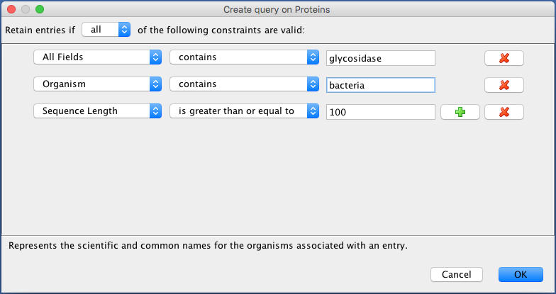
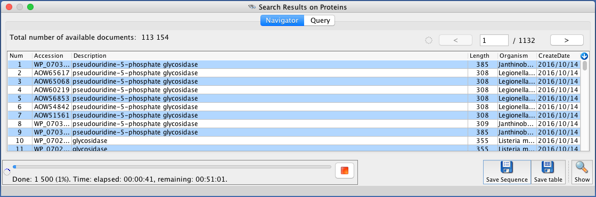
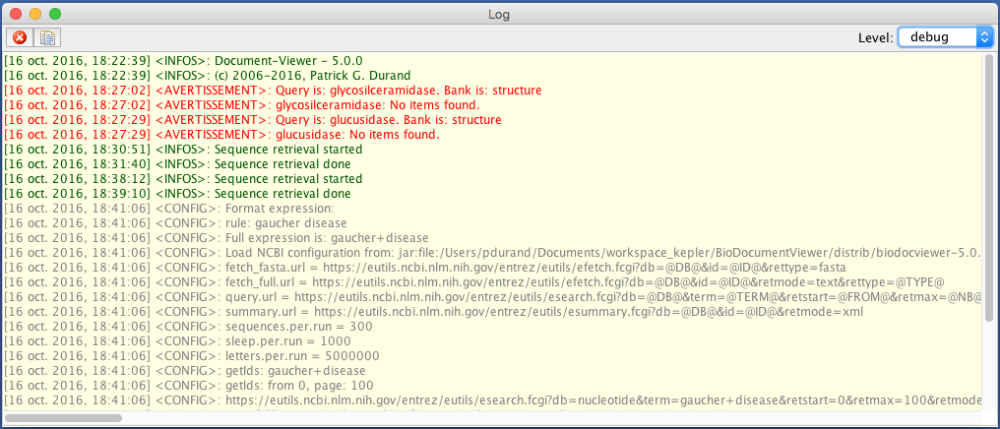

#BioDocumentViewer

##Introduction

BioDocumentViewer is a software enabling to query, browse, view and retrieve sequences from NCBI and EBI public servers.

The software has been made to facilitate the use of public web services so that it is easy to retrieve set of sequences in batch mode. 

BioDocumentViewer also provides you with viewing capabilities to display annotated sequences and 3D structures.

##Requirements

Use a [Java Virtual Machine](http://www.oracle.com/technetwork/java/javase/downloads/index.html) 1.7 (or above) from Oracle. 

*Not tested with any other JVM providers but Oracle... so there is no guarantee that the software will work as expected if not using Oracle's JVM.*

##Working with the binary release

The most easy way to use BioDocViewer Tool consists in downloading an official release. It is made of a single Java binary archive file:

    biodocviewer-x.y.z.jar

It is available from this Github page: check [Releases] tab and download the latest release.

We invite all users to start working with that tool, as explained in the next section. 

*Notice for developers:* this unique JAR file is absolutely not intended to be embedded within any other applications since it contains all the dependencies (third-party libraries) into a single large file. So, if you want to include BioDocViewer into some other softwares, start from its source code (git clone).

##User manual

###Start the graphical interface

After retrieving an official release of the BioDocumentViewer (BDV) software (see above section), you can start it quite easily:

    java -jar biodocviewer-x.y.z.jar

By default, BDV uses [NCBI Entrez eUtils services](https://www.ncbi.nlm.nih.gov/books/NBK25499/) (NCBI, Bethesda, USA) to let you query and retrieve protein and nucleotide sequences, 3D structures and taxonomy information. 

However, you can also ask BDV to use [EB-eye Search services](https://www.ebi.ac.uk/ebisearch/) (EBI, Hinxton, UK) as follows:

    java -DV_PROVIDER=EBI -jar biodocviewer-x.y.z.jar

JVM argument "V_PROVIDER" accepts one of: NCBI (default) or EBI.

###Make and run a query

Whatever the data provider you use, NCBI or EBI, the software is quite easy to use:

* select a bank to query
* click on the [Go...] button
* setup the criteria in the query dialogue box
* click on the [Ok] button... and wait a little bit to get an answer from the provider

The DocumentNavigator is displayed as soon as you get a valid answer from the bank provider, i.e. your query matches some entries.

Use the DocumentNavigator:

* to navigate through entries; use [<] [>] buttons located at the top right corner
* to display an entry in the Sequence or 3D Structure viewer
* to fetch entries as Fasta or plain format (e.g. Genbank, EMBL, Uniprot, etc.)

###NCBI/EBI recommendations

**BDV strictly respects the recommendations of NCBI and EBI for the use or their public resources**, especially when retrieving sequences in batch mode.

Basically:

* keep in mind that you are using resources that are shared by many users around the world 
* do not overload NCBI/EBI remote servers
* retrieve sequences in batch mode using timers
* provide your email address: NCBI or EBI can get in touch with you in case they consider your are querying too much their remote services. 

More about these recommendations: [here for NCBI](https://www.ncbi.nlm.nih.gov/home/about/policies.shtml#scripting), [here for EBI](http://www.ebi.ac.uk/Tools/webservices/help/faq).

###Extended configuration

BDV accepts the following optional JVM arguments on the command line:

* V_DEBUG. Accepts one of: true, false. Default is false.
* V_PROVIDER. Accepts one of: NCBI, EBI. Default is NCBI.
* V_EMAIL. Your email address; see "NCBI/EBI recommendations" section, above. Default is none, so BDV will ask you that information at runtime, the first time you use the software.

You use all these arguments as follows:

    java -DV_PROVIDER=EBI -DV_DEBUG=true ... -jar biodocviewer-x.y.z.jar

###Log viewer

BDV uses a logging framework to monitor the software... this can be quite useful when you experience NCBI/EBI connections failure. 

To access the log messages, simply click on the little icon located on the top right corner of BDV main frame, next to [Documents] pulldown menu.

By default, BDV uses "info" log level, which does not provide much messages. However, you are advised to start BDV with "-DV_DEBUG=true" to get more log messages, which can help to diagnose problems. It is worth noting that log messages are localized in your conurty (e.g. French on my OSX system).

##License and dependencies

BioDocViewer itself is released under the GNU Affero General Public License, Version 3.0. [AGPL](https://www.gnu.org/licenses/agpl-3.0.txt)

BioDocViewer depends on several thrid-party libraries as stated in the NOTICE.txt file provided with this project.

--
(c) 2007-2016 - Patrick G. Durand
