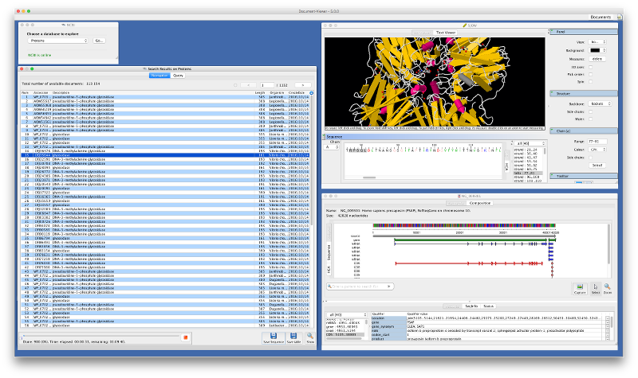

#BioDocumentViewer

##Introduction

BioDocumentViewer is a software enabling to query, browse, view and retrieve sequences from NCBI and EBI public servers.

The software has been made to facilitate the use of public web services, [NCBI Entrez eUtils services](https://www.ncbi.nlm.nih.gov/books/NBK25499/) (NCBI, Bethesda, USA) and [EB-eye Search services](https://www.ebi.ac.uk/ebisearch/) (EBI, Hinxton, UK), so that it is easy to query databanks and retrieve set of sequences in batch mode. 

##Main features

The following screenshot illustrates BioDocumentViewer main features:

* The **QueryBuilder** on the top left side; here, we use NCBI as data provider;
* the **DocumentNavigator** on the left side; **a batch sequence retrieval job** is running to get more than 100K sequences, respecting NCBI recommendations;
* the **3D Strucrure Viewer** on the right side, showing a glycosidase PDB structure;
* the **Sequence Viewer**, displaying a fully annotated Refseq gene

##Requirements

Use a [Java Virtual Machine](http://www.oracle.com/technetwork/java/javase/downloads/index.html) 1.7 (or above) from Oracle. 

As a result of using Java, BioDocumentViewer is available for Linux, Mac OSX and Windows systems.

*Not tested with any other JVM providers but Oracle... so there is no guarantee that the software will work as expected if not using Oracle's JVM.*

##Working with the binary release

The most easy way to use BioDocViewer Tool consists in downloading an official release. It is made of a single Java binary archive file:

    biodocviewer-x.y.z.jar

It is available from this Github page: check [Releases] tab and download the latest release.

We invite all users to start working with that "jar" file, as explained in the next section. 

*Notice for developers:* this unique JAR file is absolutely not intended to be embedded within any other applications since it contains all the dependencies (third-party libraries) into a single large file. So, if you want to include BioDocViewer into some other softwares, start from its source code (git clone).

##User manual

A user manual is available [here](https://github.com/pgdurand/BioDocumentViewer/wiki/User-manual).

##License and dependencies

BioDocViewer itself is released under the GNU Affero General Public License, Version 3.0. [AGPL](https://www.gnu.org/licenses/agpl-3.0.txt)

BioDocViewer depends on several thrid-party libraries as stated in the NOTICE.txt file provided with this project.

--
(c) 2006-2016 - Patrick G. Durand
